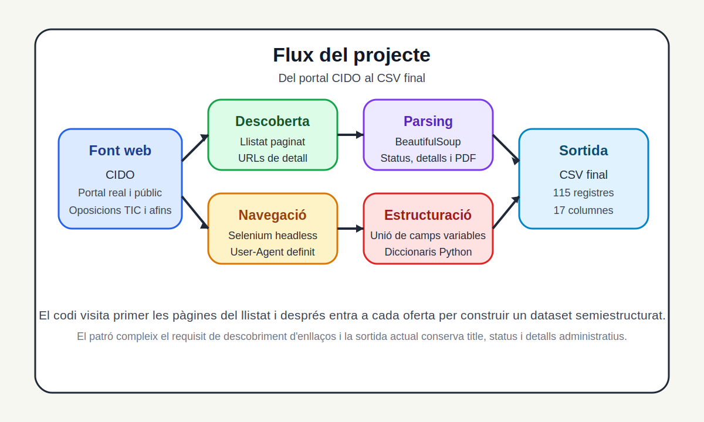
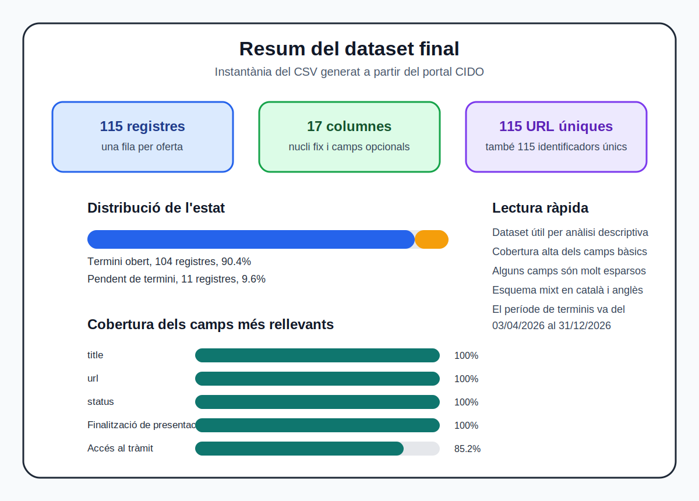

## Dades bàsiques

- Assignatura: Tipologia i cicle de vida de les dades
- Integrants: Marc Roige Benaiges i Eloi Vilella Escolano
- Web font: https://cido.diba.cat/oposicions
- Repositori: https://github.com/marcrb88/PRACT_1_Roige_Benaiges_Marc_TC
- Dataset local: `dataset/cido_oposicions.csv`
- DOI de Zenodo: https://doi.org/10.5281/zenodo.19423997

## Resum executiu

En aquesta pràctica hem construït un dataset propi a partir del portal CIDO, centrant-nos en oposicions i convocatòries de l'àmbit TIC i àrees properes amb termini obert o pendent. El projecte compleix la idea central de l'enunciat perquè no es limita a llegir una sola pàgina, sinó que descobreix enllaços, navega per un llistat paginat, entra a cada fitxa de detall i exporta el resultat a un CSV final.

El resultat actual és un conjunt de 115 registres i 17 columnes. La sortida recull camps bàsics com `title`, `status` i `url`, però també informació útil per a anàlisi posterior, com el sistema de selecció, el tipus de personal, la titulació requerida, les matèries associades i els enllaços de tràmit o de l'ens convocant. Des del punt de vista del cicle de vida de les dades, el projecte cobreix captura, estructuració, emmagatzematge i preparació per a reutilització.

## 1. Context

El context del projecte és el seguiment d'ofertes públiques d'ocupació relacionades amb informàtica, noves tecnologies i perfils tècnics afins. El web triat és el portal d'oposicions del CIDO, accessible a `https://cido.diba.cat/oposicions`, que agrega convocatòries públiques i enllaça a la documentació oficial publicada pels ens convocants.

La font és pertinent per tres motius. Primer, perquè és un portal real i viu, no un web de proves. Segon, perquè la informació publicada és institucional i remet a anuncis oficials, fet que millora la fiabilitat i la traçabilitat. Tercer, perquè la informació té valor analític clar si es vol estudiar quins perfils TIC es demanen, quin tipus de contractació domina o quines entitats concentren més convocatòries.

En termes de teoria, aquesta elecció encaixa amb el que plantegen els apunts de web scraping de la UOC. El web scraping és especialment útil quan la informació és pública i valuosa, però no s'ofereix directament en un format estructurat ni a través d'una API reutilitzable. També encaixa amb la fase de captura del cicle de vida de les dades, que després dona pas a l'emmagatzematge i a la publicació en formats reutilitzables.

## 2. Títol del dataset

Convocatòries públiques TIC i afins publicades al portal CIDO amb termini obert o pendent

## 3. Descripció del dataset

El dataset és una instantània de convocatòries d'ocupació pública vinculades a l'àmbit tecnològic que apareixen al portal CIDO amb l'estat termini obert o pendent de termini. Cada fila representa una oferta concreta i conserva la seva traçabilitat amb la URL del detall i amb camps institucionals com `Accés al tràmit` o `Web de l'ens convocant`.

La versió actual del fitxer conté 115 registres i 17 columnes. Totes les URL són úniques i també ho són els identificadors de convocatòria, de manera que el dataset no mostra duplicats evidents en la seva clau bàsica. És un conjunt de dades semiestructurat, ja que hi ha un nucli de camps presents gairebé sempre i altres camps opcionals que depenen de com s'hagi publicat cada oferta.

L'interès del dataset és doble. D'una banda, permet una lectura ràpida del mercat públic de perfils TIC a Catalunya i en entitats vinculades. De l'altra, és un bon cas de pràctica per mostrar com passar d'un web amb estructures HTML heterogènies a un CSV reutilitzable.

## 4. Representació gràfica

La figura resumeix el flux real del projecte. El codi parteix del llistat del portal CIDO, descobreix els enllaços de detall, entra a cada oferta amb Selenium, extreu els camps amb BeautifulSoup i finalment exporta el conjunt a un CSV. Aquest punt és important perquè l'enunciat demana navegació autònoma i descobriment d'enllaços, i el projecte ho fa de manera explícita.

## 5. Contingut del dataset i període temporal

### 5.1 Perfil general del conjunt

| Indicador | Valor |
| --- | --- |
| Nombre de registres | 115 |
| Nombre de columnes | 17 |
| URL úniques | 115 |
| Identificadors únics | 115 |
| Estat termini obert | 104 |
| Estat pendent de termini | 11 |
| Rang de dates de finalització | del 03/04/2026 al 31/12/2026 |
| Darrera actualització del dataset visible al repositori | 05/04/2026 |

El dataset és, per tant, una foto puntual del portal en el moment d'execució del scraper. No és una sèrie històrica. Això vol dir que reflecteix l'estat del portal a inicis d'abril de 2026 i que les dades poden variar si l'script es torna a executar més endavant.

### 5.2 Camps inclosos

| Camp | Descripció | Cobertura |
| --- | --- | --- |
| `title` | Títol de l'oferta | 100.0% |
| `url` | Enllaç a la fitxa de detall al portal CIDO | 100.0% |
| `status` | Estat de la convocatòria | 100.0% |
| `Identificador` | Identificador únic visible a la fitxa | 100.0% |
| `Expedient` | Codi intern o expedient de la convocatòria | 77.4% |
| `Finalització de presentació de sol·licituds` | Data límit o text descriptiu del termini | 100.0% |
| `Sistema de selecció` | Concurs, concurs oposició o oposició | 100.0% |
| `Tipus de personal` | Funcionari, laboral, temporal o similar | 100.0% |
| `Grup de titulació o assimilat` | Grup professional o nivell acadèmic | 99.1% |
| `Titulació requerida` | Formació requerida | 98.3% |
| `Altres requisits` | Requisits addicionals com idiomes o català | 67.8% |
| `Matèries` | Àrees temàtiques associades a l'oferta | 100.0% |
| `Web de l'ens convocant` | Web oficial de l'entitat convocant | 98.3% |
| `Accés al tràmit` | Enllaç directe al tràmit de presentació, si existeix | 85.2% |
| `Observacions` | Comentaris addicionals del portal | 13.0% |
| `Inici de presentació de sol·licituds` | Data d'obertura del tràmit, si s'indica | 5.2% |
| `Torn reservat` | Torn específic, si existeix | 0.9% |

### 5.3 Lectura analítica dels camps

Els camps més sòlids per a una anàlisi inicial són `title`, `status`, `Finalització de presentació de sol·licituds`, `Matèries`, `Sistema de selecció`, `Tipus de personal`, `Identificador` i `Web de l'ens convocant`. Amb aquests camps ja es pot fer segmentació per perfil, per entitat, per tipus de procés i per horitzó temporal.

També hi ha camps molt més irregulars, com `Inici de presentació de sol·licituds`, `Observacions` o `Torn reservat`. Això no és un error del scraper, sinó una conseqüència de l'heterogeneïtat del portal i dels documents originals. La teoria del cicle de vida de les dades ho descriu bé quan parla de dades semiestructurades i de la necessitat de separar captura, conversió i neteja.

Des del punt de vista de qualitat de dades, hi ha quatre matisos importants:

- `title` no és una clau segura perquè hi ha títols repetits. En aquesta versió hi ha tres files amb el mateix valor `1 plaça d'Analista de dades`. Per identificar registres és millor treballar amb `url` o `Identificador`, que sí són únics.
- `Finalització de presentació de sol·licituds` és complet, però no sempre és una data neta. En alguns casos inclou text explicatiu i això obliga a netejar el camp abans de fer anàlisi temporal fina.
- `Titulació requerida` és gairebé complet, però part del seu contingut no és directament analitzable perquè 31 files indiquen `Vegeu les bases` en lloc d'una titulació concreta.
- L'esquema final barreja català i anglès, perquè els camps troncals actuals són `title` i `status`, mentre que la resta de camps conserven el nom original del portal.

### 5.4 Període temporal

El període temporal del conjunt s'ha d'entendre de dues maneres. Primer, com a instantània de captura, ja que el scraper recull el que està visible al portal en un moment concret. Segon, com a període de vigència de les convocatòries, que en aquest fitxer va del 3 d'abril de 2026 al 31 de desembre de 2026, amb 11 registres que encara no tenien la data oberta i constaven com a pendents de termini.

## 6. Propietari del conjunt de dades, antecedents i criteris ètics i legals

El propietari de la font principal és el portal CIDO de la Diputació de Barcelona, que agrega convocatòries i informació oficial. Ara bé, hi ha un matís important. La capa de recopilació i publicació del portal és del CIDO, mentre que els continguts originals de cada convocatòria pertanyen a l'ens convocant corresponent. Això es veu clarament perquè cada registre conserva el camp `Web de l'ens convocant` i, sovint, diversos enllaços a butlletins oficials o tràmits externs.

Per situar aquest apartat ens basem directament en els apunts `Web scraping` i `Introducció al cicle de vida de les dades`. Aquests materials descriuen el web scraping com una tècnica útil quan cal monitoritzar fonts web públiques sense API i quan després es vol convertir la captura en un conjunt de dades reutilitzable, amb criteris de qualitat, conversió i publicació.

Des del punt de vista ètic i legal, el projecte s'ha plantejat amb criteris de prudència. Els principals passos seguits o assumits com a requisit operatiu són aquests:

- treballar només amb informació pública i sense autenticació
- no usar cap API com a via principal
- definir un `User-Agent` explícit al navegador automatitzat
- fer una navegació seqüencial i amb pauses, evitant càrrega agressiva al servidor
- conservar la traçabilitat cap a la font original mitjançant URL i enllaços a documents oficials
- no recopilar dades personals de candidats ni dades privades
- revisar de manera periòdica `robots.txt` i les condicions d'ús abans de fer execucions recurrents o massives

La teoria de web scraping insisteix que un projecte responsable no és només un script que funciona. També ha de ser un procés que respecti la infraestructura de la font, limiti la càrrega, entengui el marc legal i assumeixi que el web pot canviar.

## 7. Inspiració i preguntes que es poden respondre

Aquest dataset és interessant perquè converteix informació pública molt dispersa en una base reutilitzable per entendre millor la demanda de perfils TIC dins del sector públic i d'entitats relacionades. En comptes de mirar fitxa per fitxa, es pot fer una lectura agregada i replicable.

Comparat amb anàlisis similars de l'àmbit del web scraping, aquí el valor no és seguir preus o productes, sinó observar ocupació pública qualificada. És una aplicació especialment útil perquè combina dimensió institucional, terminis administratius i perfils professionals.

Algunes preguntes que es poden respondre amb aquest conjunt són:

- quins perfils TIC o afins apareixen amb més freqüència al portal
- quin tipus de personal domina, laboral temporal, laboral o funcionari
- quin sistema de selecció és més habitual
- quines entitats o dominis convocants concentren més ofertes
- quin pes tenen les ofertes amb requisits addicionals d'idioma o català
- quins grups de titulació i quins nivells acadèmics dominen
- fins a quin punt la informació publicada és prou neta per fer anàlisi sense preprocessat extra

Una primera lectura del fitxer ja deixa veure alguns patrons. `Informàtica` és la matèria més repetida amb 67 aparicions. `Laboral temporal` és el tipus de personal més freqüent amb 79 registres. El sistema de selecció més habitual és `Concurs o valoració de mèrits`, amb 93 casos. També destaca el pes dels grups universitaris, sobretot `A1 - Grau universitari` amb 65 registres i `A - Grau universitari` amb 31.

## 8. Llicència del dataset resultant

La llicència seleccionada per al dataset resultant és **CC BY-NC-SA 4.0**.

La tria té sentit per tres motius. Primer, obliga a reconèixer l'autoria del dataset derivat. Segon, evita l'ús comercial directe sense permís, cosa prudent quan la font és una agregació d'informació pública publicada per tercers. Tercer, obliga a compartir les obres derivades amb la mateixa llicència, fet que afavoreix reutilització acadèmica i continuïtat del treball.

No hem escollit una llicència completament oberta com CC0 perquè el dataset no és una creació original des de zero, sinó una estructuració derivada d'informació institucional agregada per un portal concret i vinculada a molts ens convocants diferents. Aquesta llicència és més conservadora i encaixa millor amb el context de la pràctica.

## 9. Codi implementat

### 9.1 Estructura del codi

| Fitxer | Funció principal |
| --- | --- |
| `source/main.py` | Orquestra el procés complet i desa el CSV final |
| `source/fetch_list_selenium.py` | Recorre el llistat paginat i descobreix les URL de detall |
| `source/fetch_detail.py` | Extreu `title`, `status`, detalls `dt/dd` i detecta enllaços a PDF |
| `source/export_dataset.py` | Construeix l'esquema final del CSV i l'exporta |
| `requirements.txt` | Fixa versions de dependències |

El punt d'entrada és `python source/main.py`. Des d'aquí es crida primer la fase de descoberta i després la fase de detall. Un cop completada la captura, el conjunt s'exporta a `dataset/cido_oposicions.csv`.

### 9.2 Flux de funcionament

El codi segueix aquest flux:

1. obrir el llistat filtrat del portal CIDO
2. recórrer les pàgines una a una fins que no apareguin més resultats
3. guardar per a cada entrada `title` i `url`
4. entrar a cada fitxa de detall amb Selenium
5. parsejar el HTML amb BeautifulSoup
6. extreure `status`, els detalls variables i detectar els enllaços a PDF
7. unificar totes les claus trobades i exportar-les a un CSV

### 9.3 Llibreries i versions

Les dues dependències principals del codi són `selenium==4.36.0` i `beautifulsoup4==4.14.3`, a més de llibreries estàndard de Python com `csv`, `pathlib` i `time`. El repositori també inclou un `requirements.txt` complet generat amb totes les dependències pinades.

### 9.4 Dificultats del lloc web i com s'han resolt

El lloc web no presenta el dataset final en una sola taula simple. Hi ha un llistat paginat i, dins de cada oferta, una pàgina de detall amb camps que poden variar. Aquest és el principal repte tècnic del projecte.

La justificació tècnica de combinar Selenium i BeautifulSoup és central en aquest cas. Selenium s'encarrega de la navegació i de recuperar l'HTML un cop la pàgina ja ha estat renderitzada al navegador. Això és especialment útil al llistat d'oposicions, on el portal no es limita a una sola pàgina i mostra més resultats mitjançant la navegació del mateix cercador, amb l'acció `Consulta més resultats` i URLs amb el paràmetre `page`. El nostre codi replica aquesta lògica generant `page=1`, `page=2`, `page=3` i així successivament.

Un cop Selenium ha carregat cada pàgina del llistat, el codi espera `1.5` segons abans de parsejar-la. Aquest `sleep` dona temps perquè el navegador acabi d'inserir els elements del llistat al DOM i evita llegir una pàgina encara inestable. Després, BeautifulSoup s'utilitza per localitzar els blocs `div.panel-oposicions` i extreure els enllaços de detall. A les pàgines de detall el JavaScript té menys pes per a l'extracció, però el patró es manté. Selenium carrega la pàgina i BeautifulSoup parseja el `page_source` ja renderitzat per extreure `status` i la resta de camps administratius.

Les dificultats més rellevants i la solució aplicada han estat aquestes:

- **descoberta d'enllaços**. El codi recorre la paginació fins que troba una pàgina sense entrades. Això evita haver de fixar manualment el nombre de pàgines.
- **navegació automatitzada**. S'ha fet servir Selenium en mode headless per garantir que el contingut renderitzat sigui accessible i estable.
- **estructura semiestructurada**. La informació de detall es captura a partir de parelles `dt` i `dd`, que després es guarden en un diccionari flexible.
- **documentació annexa**. El parser detecta enllaços PDF quan existeixen, però la versió actual del `main.py` no els incorpora a la fila final del CSV.
- **heterogeneïtat del dataset**. L'exportador construeix les columnes de manera dinàmica i, en la versió actual, conserva l'ordre d'aparició dels camps.

### 9.5 Punts forts del codi

- separació clara entre descoberta, detall i exportació
- ús combinat de Selenium i BeautifulSoup, que simplifica navegació i parsing
- gestió d'errors per oferta, de manera que una fallada puntual no para tot el procés
- exportació robusta tot i tenir camps opcionals
- ordre de columnes més estable després del refactor de `collect_fieldnames`
- sortida final fàcil de reproduir amb una sola comanda

Dit d'una altra manera, el codi resol bé la pràctica i compleix el requisit de modularitat, amb una estructura clara i fàcil de seguir.

## 10. Dataset final i publicació

El dataset resultant es troba a la carpeta `dataset/` del repositori amb el nom `cido_oposicions.csv`. El fitxer és directament reutilitzable en eines d'anàlisi com Python, R, Excel o LibreOffice Calc.

El dataset també està publicat a Zenodo i el `README.md` del repositori ja incorpora l'enllaç definitiu.

DOI del dataset publicat:

`https://doi.org/10.5281/zenodo.19423997`

Descripció breu coherent amb la versió actual del CSV:

Dataset amb convocatòries públiques TIC i afins publicades al portal CIDO amb termini obert o pendent, capturades automàticament amb Python, Selenium i BeautifulSoup. Cada registre conserva la URL de detall, l'estat de la convocatòria i els principals camps administratius visibles a la fitxa.

## 11. Conclusions

La pràctica compleix els objectius principals de l'activitat. S'ha seleccionat una font real, s'ha implementat un scraper modular en Python, s'ha fet descobriment d'enllaços i navegació autònoma, i s'ha generat un dataset CSV reutilitzable. A més, el cas triat no és trivial perquè obliga a combinar paginació, navegació automatitzada i extracció de camps semiestructurats.

Des del punt de vista de la teoria, el projecte mostra bé la relació entre captura, conversió, emmagatzematge i publicació. També deixa clar que un bon scraper no és només una qüestió de codi, sinó també de qualitat de dades, traçabilitat i prudència legal. La versió actual del repositori deixa un marge de millora clar, alinear del tot el parser i la sortida final perquè decisions com la inclusió o no dels `pdfs` quedin reflectides de manera coherent.

## Taula de contribució

Distribució resumida de contribucions:

| Tasca | MR | EV |
| --- | --- | --- |
| Selecció del cas i enfocament del projecte | X | X |
| Implementació principal del scraper i estructura base del repositori | X |  |
| Ajustos finals i generació del dataset publicat al repositori |  | X |
| Revisió de memòria i lliurament final | X | X |

## Referències

- Apunts `Web scraping` (`PID_00256968`), FUOC.
- Apunts `Introducció al cicle de vida de les dades` (`PID_00265702`), FUOC.
- Portal CIDO de la Diputació de Barcelona, secció d'oposicions. https://cido.diba.cat/oposicions
